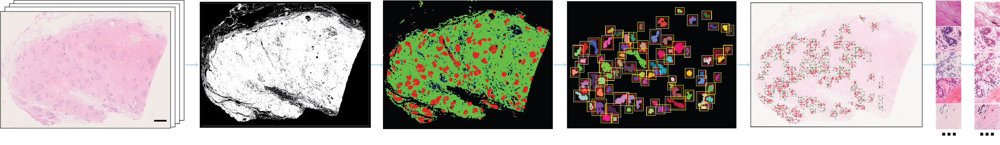

# **A CNN-based _NBT-Classifier_ facilitates analysing different normal breast tissue compartments on whole slide images**

[Paper]() | [Cite]()

**Abstract:** Whole slide images (WSIs) are digitized tissue slides increasingly adopted in clinical practice and serve as promising resources for histopathological research through advanced computational methods. Recognizing tissue compartments and identifying regions of interest (ROIs) are fundamental steps in WSI analysis. In contrast to breast cancer, tools for high-throughput analysis of WSIs derived from normal breast tissue (NBT) are limited, despite NBT being an emerging area of research for early detection. We collected 70 WSIs from multiple NBT resources and cohorts, along with pathologist-guided manual annotations, to develop a robust convolutional neural network (CNN)-based classification model, named _NBT-Classifier_, which categorizes three major tissue compartments: epithelium, stroma, and adipocytes. The two versions of _NBT-Classifier_, processing 512 x 512- and 1024 x 1024-pixel input patches, achieved accuracies of 0.965 and 0.977 across three external datasets, respectively. Two explainable AI visualization techniques confirmed the histopathological relevance of the high-attention patterns associated with predicting specific tissue classes. Additionally, we integrated a WSI pre-processing pipeline to localize lobules and peri-lobular regions in NBT, the output from which is also compatible with interactive visualization and built-in image analysis on the QuPath platform. The _NBT-Classifier_ and the accompanying pipeline will significantly reduce manual effort and enhance reproducibility for conducting advanced computational pathology (CPath) studies on large-scale NBT datasets.

<p align="center">
    
</p>

## Installation
To get started, clone the repository, install [HistoQC](https://github.com/choosehappy/HistoQC.git) and other required dependencies. 
```
git clone https://github.com/SiyuanChen726/NBT-Classifier.git
cd NBT-Classifier
conda env create -f environment.yml
conda activate tfgpu-env
```

## Implementation

WSI data is expected to be organised as follows:
```
prj_BreastAgeNet/
├── CLINIC/clinicData_all.csv
├── WSIs
│   ├── KHP/slide1.ndpi, slide2.ndpi ...
│   ├── NKI/slide1.mrxs, ...
│   ├── BCI/slide1.ndpi, ...
│   ├── EPFL/slide1.vsi, ...
│   └── SGK/slide1.svs, ...
```

First, implement HistoQC to detect foreground tissue regions:
```
python -m histoqc -c v2.1 -n 3 "*.ndpi" # "*.mrxs", "*.svs"
```
This step yields:
```
prj_BreastAgeNet/
├── WSIs
├── QC/KHP
│   ├── slide1/slide1_maskuse.png
│   └── ...
```

Then, use the following script to classify NBT tissue components:
```
python run_TC.py \
  --WSI /path/to/WSI/directory \
  --MASK /path/to/mask/directory \
  --TC_output /path/to/output/directory \
  --WEIGHT data/MobileNet512px.h5 \
  --foreground_thes 0.7 \
  --patch_size 128 \
  --save_TCmap True \
  --free_space True \
```
This step yields:
```
prj_BreastAgeNet/
├── WSIs
├── QC/KHP
│   ├── slide1/slide1_maskuse.png
│   └── ...
├── TC/KHP
│   ├── slide1/slide1_TCmask.png
│   └── ...
```

Finally, use the following script to localise ROIs:
```
python run_bbx.py \
  --WSI /path/to/WSI/directory \
  --TC_output /path/to/output/directory \
  --patch_size 128 \
  --upsample 32 \
  --small_objects 400000 \
  --roi_width 250 \
  --save_bbxpng \
  --save_patchcsv
```
This step yields:
```
prj_BreastAgeNet/
├── WSIs
├── QC/KHP
│   ├── slide1/slide1_maskuse.png
│   └── ...
├── TC/KHP
│   ├── slide1/slide1_TCmask.png
│   └── ...
├── Features/KHP
│   ├── slide1/slide1_patch.csv
│   └── ...
```

For a full implementation of **_NBT-Classifier_**, please take a look at [notebook pipeline](pipeline.ipynb). 
