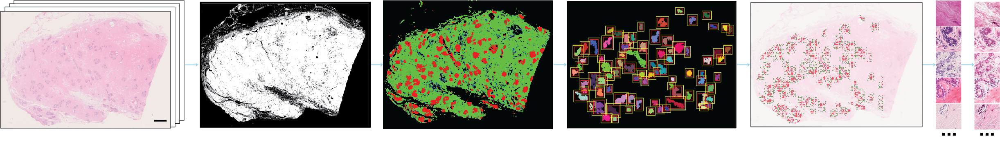

# **Normal breast tissue classifiers assess large-scale tissue compartments with high accuracy**

[Paper](https://www.biorxiv.org/content/10.1101/2025.04.27.649481v1)

**Abstract:** Cancer research emphasises early detection, yet quantitative methods for normal tissue analysis remain limited. Digitised haematoxylin and eosin (H&E)-stained slides enable computational histopathology, but artificial intelligence (AI)-based analysis of normal breast tissue (NBT) in whole slide images (WSIs) remains scarce. We curated 70 WSIs of NBTs from multiple sources and cohorts with pathologist-guided manual annotations of epithelium, stroma, and adipocytes (https://github.com/cancerbioinformatics/OASIS). Using this dataset, we developed robust convolutional neural network (CNN)-based, patch-level classification models, named NBT-Classifiers, to tessellate and classify NBTs at different scales. Across three external cohorts, NBT-Classifiers trained on 128 x 128 µm and 256 x 256 µm patches achieved AUCs of 0.98–1.00. Two explainable AI-visualisation techniques confirmed the biological relevance of tissue class predictions. Moreover, NBT-Classifiers can be integrated into an end-to-end pre-processing framework to support efficient downstream image analysis in lobular regions. Their high compatibility with QuPath further enables broader application in studies of normal tissues, in the context of breast.


<p align="center">
    
</p>


## 1. Installation

To get started, install [HistoQC](https://github.com/choosehappy/HistoQC.git) and NBT-Classifier:
```
git clone https://github.com/choosehappy/HistoQC.git
git clone https://github.com/SiyuanChen726/NBT-Classifier.git
cd NBT-Classifier
conda env create -f environment.yml
conda activate nbtclassifier
```


## 2. Docker
NBT-Classifier supports Docker for reproducible analysis of user histology data, with examples for both command-line and Jupyter notebook. 

To get the Docker image:
```
docker pull siyuan726/nbtclassifier:latest
```

or use singularity for HPC:
```
singularity pull docker://siyuan726/nbtclassifier:latest
```


## 3. Implementation using host data 

Host data is expected to be organised as follows:
```
project/
├── WSIs/host slides, such as slide1.ndpi, slide2.ndpi, slide3.svs, ...
├── QCs/
└── FEATUREs/
```

The following code launches Singularity container on a HPC GPU computation node with NVIDIA GPU support:
```
singularity shell --nv \  # Enable NVIDIA GPU support
--bind /the/host/folder/project:/app/project \  # Mount host folder to /app/project in container
--writable-tmpfs \  # Allow writing to a temporary filesystem
./nbtclassifier_latest.sif  # Singularity image to launch

# manually activate conda environment
source /opt/conda/etc/profile.d/conda.sh
conda activate nbtclassifier 
```
Within the nbtclassifier docker container, you will see an app folder under "root" and the host directory `/the/host/folder/project` is mounted to the `/app/project` folder.


First, implement HistoQC to obtain masks of foreground tissue regions:
```
cd /app/HistoQC
python -m histoqc -c NBT -n 3 '/app/project/WSIs/*.ndpi' -o '/app/project/QCs'    #change `.ndpi` into the exact format of the host WSI files
```

Then, use the following script to tessellate and classify NBT tissue components on WSIs:
```
cd /app/NBT-Classifier
python main.py \
--wsi_folder /app/project/WSIs \
--mask_folder /app/project/QCs \
--output_folder /app/project/FEATUREs \
--model_type TC_512 \
--patch_size_microns 128 \
--use_multithreading \   # Remove this line to disable multithreading (use single-threaded mode)
--max_workers 32
```

These two steps yields:
```
/app/
├── NBT-Classifier/
├── HistoQC/
├── examples/
├── Dockerfile
└── project/
    ├── WSIs/
    ├── QCs/
    │   |── slide1/slide1_mask_use.png, ... 
    │   └── ... 
    └── FEATUREs/
        |── slide1/
        |   ├──slide1_TC_512_pattern_x_idx.npy     
        |   ├──slide1_TC_512_pattern_y_idx.npy     
        |   ├──slide1_TC_512_pattern_im_shape.npy  
        |   ├──slide1_TC_512_pattern_patches.npy    
        |   ├──slide1_TC_512_probmask.npy                     # This contains the tissue classification results
        |   ├──slide1_TC_512.png                              # This visualises the tissue classification map
        |   ├──slide1_TC_512_patch_all.csv                    # This saves all classified patches
        |   ├──slide1_TC_512_cls_wsi.json                     # This imports all classified patches into QuPath via the annotation_loader.groovy script
        |   ├──slide1_TC_512_epi_(18,0,0,8704,6208)-mask.png  # This imports detected lobuels into QuPath via the mask2annotation.groovy script
        |   ├──slide1_TC_512_patch_roi.csv                    # This saves the selected patches from ROIs containing lobules and peri-lobular stroma
        |   ├──slide1_TC_512_cls_roi.json                     # This imports selected patches into QuPath using the annotation_loader.groovy script
        |   └──slide1_TC_512_bbx.png                          # This visualises the selected ROIs
        └── ...
```


Alternatively, tessellate and classify NBTs using larger patches of 1024x1024 pixels:
```
cd /app//NBT-Classifier
python main.py \
--wsi_folder /app/project/WSIs \
--mask_folder /app/project/QCs \
--output_folder /app/project/FEATUREs \
--model_type TC_1024 \
--patch_size_microns 256 \
--use_multithreading \    # Remove this line to disable multithreading (use single-threaded mode)
--max_workers 32
```


## 4. Command-Line Implementation Using Example Data

In the local terminal, please prepare the following folders:
```
mkdir -p /path/to/your/project/QCs /path/to/your/project/FEATUREs
```

run the following to launch the nbtclassifier docker container:
```
singularity shell --nv \ 
--bind /path/to/your/project:/app/project \
--writable-tmpfs 
./nbtclassifier_latest.sif
```

within the container, run the following:
```
# manually activate conda environment
source /opt/conda/etc/profile.d/conda.sh
conda activate nbtclassifier

# obtain foreground tissue mask
cd /app/HistoQC
python -m histoqc -c NBT -n 4 '/app/examples/QuPath/*.ndpi' -o '/app/project/QCs'

# tessellate and classify WSIs of NBTs using 512x512-pixel patches
cd /app//NBT-Classifier
python main.py \
--wsi_folder /app/examples/QuPath \
--mask_folder /app/project/QCs \
--output_folder /app/project/FEATUREs \
--model_type TC_512 \
--patch_size_microns 128 \
--use_multithreading \
--max_workers 32

# or tessellate and classify WSIs of NBTs using 1024x1024-pixel patches
python main.py \
--wsi_folder /app/examples/QuPath \
--mask_folder /app/project/QCs \
--output_folder /app/project/FEATUREs \
--model_type TC_1024 \
--patch_size_microns 256 \
--use_multithreading \
--max_workers 32
```
the results can then be checked in the host directory `/the/host/folder/project`.


## 5. Jupyter notebook Demonstration Using Example Data

The nbtclassifier Docker image provides reproducible demonstrations of the following notebooks:
- [NBT-Classifier framework](/notebooks/NBT_pipeline.ipynb) 
- [manual annotation](/notebooks/vis_annotation.ipynb)
- [model interpretability](/notebooks/vis_CAMs.ipynb)
- [feature visualisation](/notebooks/vis_features.ipynb)


To access and run the notebooks, within the nbtclassifier docker container, execute the following:
```
cd /app/NBT-Classifier

# register the conda environment as a Jupyter kernel
python -m ipykernel install \
    --user \
    --name=nbtclassifier \
    --display-name="NBTClassifier"

chmod +x run_jupyter.sh
./run_jupyter.sh
```
Please then check the notebooks in the `/notebooks` folder


## 6. QuPath Demonstration Using Example Data

NBT-Classifiers output pseudo patch-level annotations for the whole slide or the identified lobular regions, which can be visualised and analysed further in QuPath.

The nbtclassifier Docker Image provides examples for the use of QuPath. Within the nbtclassifier docker container, run the following to copy the `/QuPath` folder to your local file system.

```
cp -r /app/examples/QuPath /app/project/
```

In your host directory `/the/host/folder/project`, you will find:
```
project/
├── QuPath/
|   ├── project.qpproj
|   │── scripts/
|   ├── 17064108_FPE_1.ndpi
|   │── annotations/17064108_FPE_1.geojson
|   │── 17064108_FPE_1_TC_512_cls_wsi.json
|   │── 17064108_FPE_1_TC_512_cls_roi.json
|   │── masks/17064108_FPE_1.ndpi_epi_(18,0,0,8704,6208)-mask.png
|   └── ...
└── ...
```

You could then:
- open the QuPath project `project.qpproj` (you might need to re-link the WSI `17064108_FPE_1.ndpi`);
- load `17064108_FPE_1.geojson` to check the corresponding manual annotation;
- go to `Automate` -> `Project scripts...` -> `mask2annotation` to load the binary lobule mask `17064108_FPE_1.ndpi_epi_(18,0,0,8704,6208)-mask.png`;
- go to `Automate` -> `Project scripts...` -> `annotation loader` to load the .json files `17064108_FPE_1_TC_512_cls_wsi.json` and `17064108_FPE_1_TC_512_cls_roi.json` (please make sure the Fill mode is enabled for detection).

